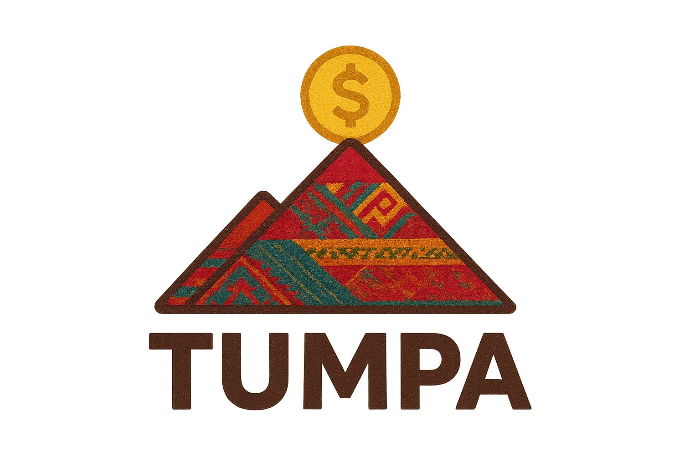

# 📌 Proyectos del Equipo

👥 **Integrantes del equipo:**
- **Dario Michel Siñani Durán**  
- **Valeria Alexandra Cuellar Coca**  
- **Velasquez Mendia Gabriel Adrian**  
- **Fernández Sivila Julián Valentino**  

---

## 📂 Descripción de Proyectos

### 🛒 App Tienda
Aplicación móvil para la **gestión y venta de productos** en un mini mercado de Sucre.  

---

### 🕹️ CTF
Paquete de scripts que prepara una máquina simple con lo **básico para una competencia CTF**.  

---

### 🎮 PlayStation
Sistema de **control de inventario** como parte de un proyecto de control de producción.  

---

### 🚦 Tránsito
Aplicación móvil elaborada en **Flutter** con arquitectura de **microservicios**.  
Consume **3 backends diferentes** con bases de datos separadas, incluyendo visión por computadora para la **organización del tráfico y estacionamiento** en la ciudad de Sucre.  

---

### 🏨 Tarcos
Aplicación web para un **hotel en el centro de Sucre**.  
- Backend: **Python**  
- Frontend: **Tailwind CSS**  
- Incluye funcionalidades de comentarios dinámicos.  

---

### 🎟️ Sistema-boletos-Sas
Sistema de **venta de boletos en línea** para el Cine Sas (Sucre).  
Incluye panel administrativo y **estadísticas de ventas**.  

---

### 🎓 Proyecto-Campus-Virtual
Sistema de **campus virtual** con funcionalidades completas de administrador, docente y estudiante.  

---

### 🏥 Logit-Life-Line
Sistema en tiempo real para la **detección de accidentes por caídas** en hogares o instituciones mediante **visión artificial**.  

---

### 🗳️ Detección Actas Electorales
Sistema OCR con **red neuronal convolucional** para la **detección automática y conteo de votos** en actas electorales.  

---

### 🥟 Salteñería-Laravel
Sistema de ventas completo para una **Salteñería**, desarrollado con **Laravel**.  

---

### 💱 Conversor de Monedas y Temperaturas (Java)
- Conversor de monedas: **Bolivianos ↔ Dólar, Euro, Libras, Yen, Won**.  
- Conversor de temperaturas: **Fahrenheit ↔ Celsius ↔ Kelvin**.  

---

### 🩺 CRUD de Pacientes
Backend para un sistema de **registro de pacientes** en un hospital.  

---

### 🔐 Encriptador y Desencriptador de Texto
Aplicación web desarrollada con **HTML, CSS y JavaScript**.  

---

### 📊 Sistema de Gestión de Productos y Rentabilidad
Sistema desarrollado con **PHP, HTML y CSS**.  
Incluye:
- **Gráficos de barras**.  
- Aplicación de la **regla de Pareto**.  
- Comparación de rentabilidad de productos por **meses o años**.  

---

### 🥊 Boxing Atari
IA en **Python**, capaz de aprender los movimientos del oponente utilizando la **fórmula de Fellman**, logrando derrotarlo en una pelea de boxeo.  

---

### 🧩 Laberinto Complejo
IA en **Python**, diseñada para resolver **laberintos** y encontrar la **ruta más óptima** para la entrega de paquetes.  

---

## 🖼️ Cómo Agregar Imágenes o Animaciones

Puedes incluir imágenes o gifs en el README:

```markdown


